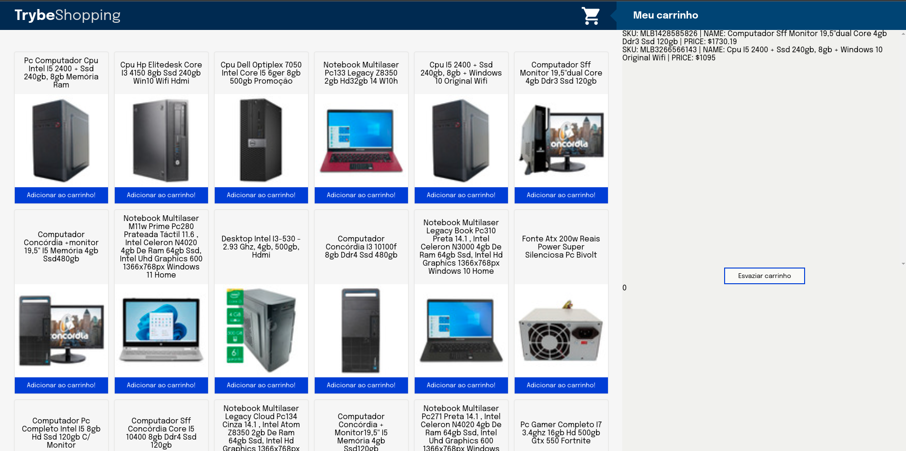

<!-- Introdução -->
<h1 align="center"> Projeto Shopping Cart - :seven: </h1>

<!-- Descrição -->
<p align="center">
Este é meu sétimo projeto em minha jornada como desenvolvedor,
nele desenvolvi uma página compras, alimentada pela API pública do Mercado Livre.
Esta página foi criata utilizando html, js e css, com rendirzação dinâmica de produtos, 
com um carrinho de compras funcional que utiliza localstorage a automátiza os processos 
de adição e exclusão de produtos, assim como de seus respectivos válores.
</p>

#
<!-- Habilidades -->
<h2 align="center"> Habilidades Desenvolvidas: </h2>

* Utilizei _HTML_ para construir uma página responsiva e dinâmica. :heavy_check_mark:
* Apliquei _HTML Semântico_ para produzir um código limpo e claro. :heavy_check_mark:
* Utilizei _JavaScript_ para extrair e tratar dados de uma API. :heavy_check_mark:
* Apliquei _JavaScript_ para gerenciar o DOM e LocalStorage, dando funcionalidade à aplicação. :heavy_check_mark:
* Utilizei _CSS_ para adicionar estilo, posicionar elementos e fornecer feedbacks visuais. :heavy_check_mark:
* Apliquei _Test Diven Development_ para produzir testes unitários que deram mais confiabilidade à aplicação. :heavy_check_mark:

#
<!-- Preview -->
<h2 align="center"> Preview: </h2>

<div align="center">
    
</div>

#
<!-- Ferramentas utilizadas -->
<details align="center">
  <summary>
	  <h2>Ferramentas e Tecnologias utilizadas:</h2>
	</summary>

  <div align="center">

  | Linguagens              | Tecnologias             | Frameworks              |
  | :---------------------- | :---------------------- | :---------------------- |
  | JavaScript              | HTML                    | Jest                    |
  | .                       | CSS                     | .                       |

  </div>

</details>

#
<!-- Instalação e utilização -->
<details align="center">
  <summary>
    <h2>Como instalar e utilizar o projeto:</h2>
  </summary>

<details>
  <summary>
    <h3>Especificações Tecnicas:</h3>
  </summary>

  <div align="left">
  
  * Git - <i> `git -v` informará a versão em uso.</i>
  * NPM V8+ - <i> `npm -v` informará a versão em uso.</i>
  * NodeJS V14+ - <i> `node -v` informará a versão em uso.</i>

  </div>

  #

  </details>

  <div align="left">
    
  1. Faça a clonagem do projeto - <i>Dependencias externas são utilizadas</i>
  ```shell
  git clone git@github.com:luanfgoncalves/project-shopping-cart.git
  ```
  > git clone -link do projeto-
  2. instale as dependencias na Raiz do projeto - <i>Não é necessário  realizar `audit fix`</i>
  ```shell
  npm install
  ```
  3. É possivel testar a plicação via npm e jest - <i>Os arquivos correspondentes estão em '/tests'</i>
  ```shell
  npm test
  ```
  4. Para utilizar o app basta abrir index.html na raíz do projeto - <i>Depende de script.js e style.css</i>
   
  </div>

</details>

#
<!-- Meu contato -->
<h2 align="center"> Connect with me: </h2>

<div align="center">
  <a href="https://instagram.com/luanfgoncalves" target="_blank"></a>
  <a href = "mailto:luanfgoncalves@outlook.com"></a>
  <a href="https://www.linkedin.com/in/luanfgoncalves/" target="_blank"></a> 
</div>
